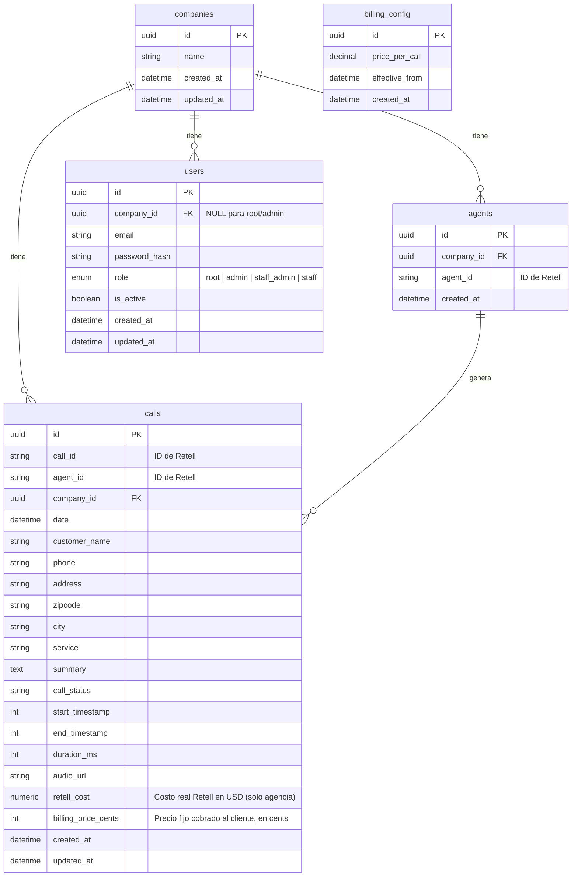

# Base de Datos — Call System

## Diagrama ER

---

## Tablas

### companies

Cada empresa de tree service registrada en la plataforma.

| Campo | Tipo | Descripcion |
|---|---|---|
| id | UUID | Identificador unico |
| name | VARCHAR | Nombre de la empresa |
| created_at | TIMESTAMP | Fecha de creacion |
| updated_at | TIMESTAMP | Ultima actualizacion |

### agents

Agentes de Retell asociados a una compania. Una compania puede tener multiples agentes.

| Campo | Tipo | Descripcion |
|---|---|---|
| id | UUID | Identificador unico |
| company_id | UUID FK | Compania a la que pertenece |
| agent_id | VARCHAR | ID del agente en Retell |
| created_at | TIMESTAMP | Fecha de creacion |

**Indices:**
- `agent_id` UNIQUE — para lookup rapido al recibir webhooks

**Relaciones:**
- Pertenece a `companies` via `company_id`

### users

Usuarios del dashboard. Root y admin no tienen company_id (ven todo). Staff_admin y staff pertenecen a una compania.

| Campo | Tipo | Descripcion |
|---|---|---|
| id | UUID | Identificador unico |
| company_id | UUID FK | Compania (NULL para root/admin) |
| email | VARCHAR | Email de login (unico) |
| password_hash | VARCHAR | Password hasheado |
| role | ENUM | root, admin, staff_admin, staff |
| is_active | BOOLEAN | Si el usuario puede hacer login |
| created_at | TIMESTAMP | Fecha de creacion |
| updated_at | TIMESTAMP | Ultima actualizacion |

**Indices:**
- `email` UNIQUE — login unico
- `company_id` — filtrar usuarios por compania

**Relaciones:**
- Pertenece a `companies` via `company_id` (nullable)

### calls

Cada llamada registrada. Se llena en una sola fase: el webhook `call_ended` trae todos los datos (cliente + audio + duracion + costo + transcript) al terminar la llamada. Ver ADR-006.

| Campo | Tipo | Descripcion |
|---|---|---|
| id | UUID | Identificador unico |
| call_id | VARCHAR | ID de la llamada en Retell |
| agent_id | VARCHAR | ID del agente en Retell |
| company_id | UUID FK | Compania derivada del agent_id |
| date | TIMESTAMP | Fecha/hora de la llamada |
| customer_name | VARCHAR | Nombre del cliente que llamo |
| phone | VARCHAR | Telefono del cliente |
| address | VARCHAR | Direccion del cliente |
| zipcode | VARCHAR | Codigo postal |
| city | VARCHAR | Ciudad |
| service | VARCHAR | Servicio solicitado (texto libre) |
| summary | TEXT | Resumen de lo que pidio el cliente |
| call_status | VARCHAR | Estado de la llamada (ended, etc.) |
| start_timestamp | BIGINT | Timestamp de inicio (ms) |
| end_timestamp | BIGINT | Timestamp de fin (ms) |
| duration_ms | INT | Duracion en milisegundos |
| audio_url | VARCHAR | URL del audio de la llamada |
| retell_cost | NUMERIC(10,6) | Costo real Retell en USD dolares. Solo visible para root/admin. Ver ADR-003 |
| billing_price_cents | INTEGER | Precio fijo cobrado al cliente, en centavos USD |
| created_at | TIMESTAMP | Fecha de creacion del registro |
| updated_at | TIMESTAMP | Ultima actualizacion |

**Indices:**
- `(call_id, agent_id)` UNIQUE — idempotencia del upsert ante reproceso/retry de n8n
- `company_id` — filtrar llamadas por compania
- `date` — ordenar y filtrar por fecha
- `phone` — agrupar por cliente en registro de clientes

**Relaciones:**
- Pertenece a `companies` via `company_id`

### billing_config

Configuracion del precio por llamada. Solo el root puede modificarlo. Se guarda historico para que el precio aplique solo a llamadas futuras.

| Campo | Tipo | Descripcion |
|---|---|---|
| id | UUID | Identificador unico |
| price_per_call | DECIMAL | Precio fijo por llamada |
| effective_from | TIMESTAMP | Desde cuando aplica este precio |
| created_at | TIMESTAMP | Fecha de creacion |

---

## Decisiones de Diseno

- **UUID vs INT:** UUIDs para evitar IDs predecibles en URLs y facilitar integracion futura.
- **agent_id como VARCHAR:** Es un ID externo de Retell (formato `agent_xxx`), no un UUID propio.
- **(call_id, agent_id) UNIQUE:** Hace idempotente el upsert de `call_ended` — un reproceso o retry de n8n actualiza la misma fila en vez de duplicarla (ADR-006).
- **billing_price_cents en calls:** Se guarda el precio al momento de la llamada para que cambios futuros en billing_config no afecten llamadas pasadas.
- **retell_cost en USD dolares (numeric), no en cents:** Decision documentada en ADR-003. n8n preprocesa el costo de Retell y lo manda como decimal en dolares. Se guarda tal cual con precision sub-centavo. Inconsistencia deliberada con billing_price_cents (integer cents).
- **company_id en calls:** Se deriva del agent_id al recibir el webhook, evitando JOINs innecesarios en queries frecuentes.
- **billing_config como tabla separada:** Permite historico de precios y saber que precio estaba vigente en cada momento.
