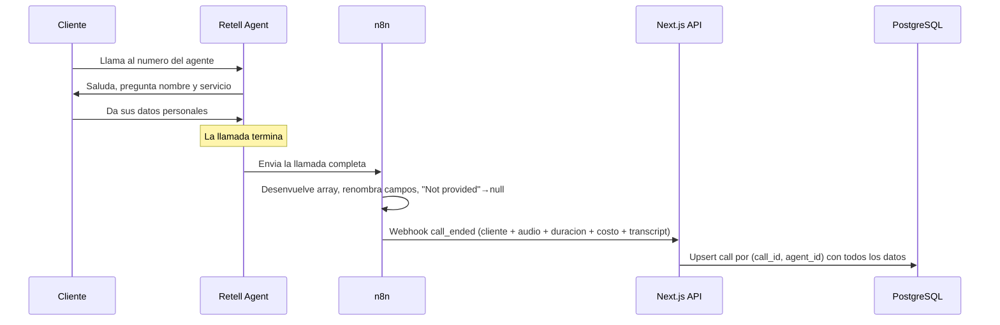
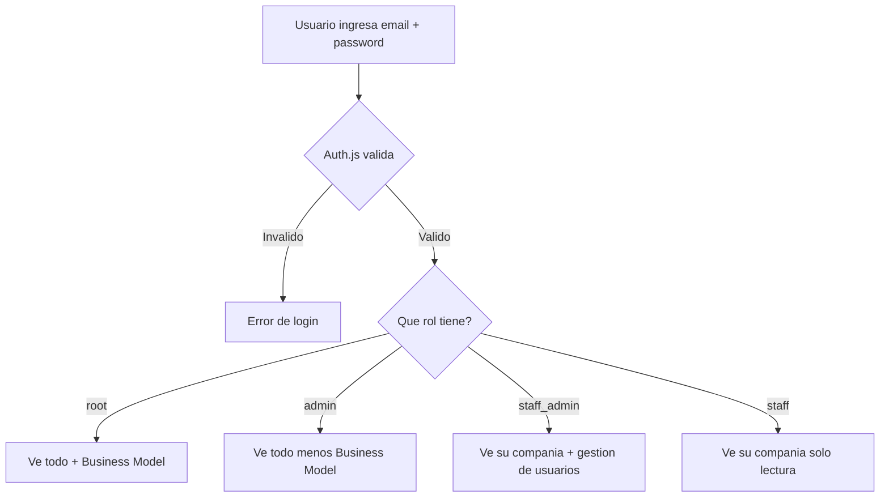
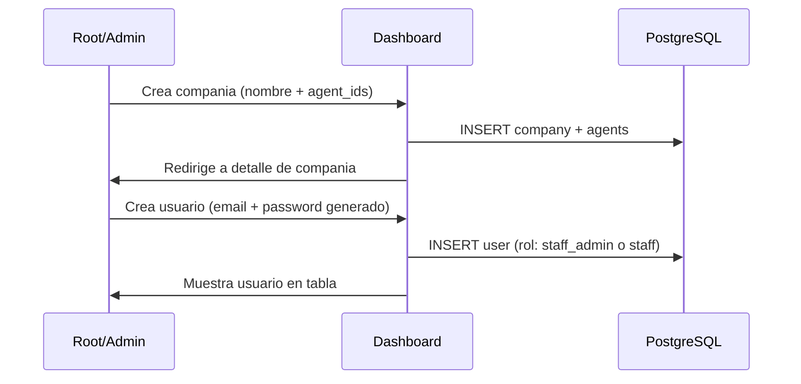
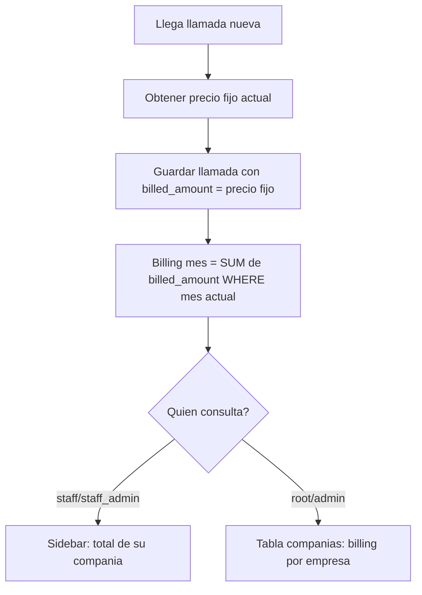
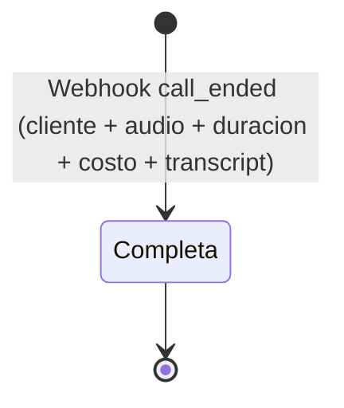

# Flujos — Call System

## Flujo 1: Recepcion de llamada y almacenamiento

Cuando un cliente llama al numero del agente Retell, el agente captura sus datos. Al terminar la llamada, n8n procesa toda la informacion y envia **un solo webhook** (`call_ended`) al dashboard con todos los datos: cliente, metadatos (audio, duracion, costo, timestamps) y transcript. (Ver ADR-006 — el antiguo webhook `call_data` se deprecó.)

---

## Flujo 2: Autenticacion y acceso por rol

El admin de la agencia crea companias y usuarios. Cada usuario accede al dashboard y ve contenido filtrado segun su rol y compania.

---

## Flujo 3: Creacion de compania y usuarios

El root o admin crea una compania asociada a uno o mas agent_id de Retell. Luego crea usuarios para esa compania.

---

## Flujo 4: Calculo de billing mensual

Cada llamada se registra con el precio fijo vigente al momento de entrar. El billing mensual se calcula sumando los costos de todas las llamadas del mes en curso.

---

## Maquinas de Estados

### Llamada (Call)

Desde ADR-006 una llamada se registra en una sola fase: el webhook `call_ended`
trae todos los datos al terminar la llamada. No existe un estado intermedio
"Parcial".

| Estado | Descripcion |
|---|---|
| Completa | Webhook `call_ended` recibido, registro completo |
